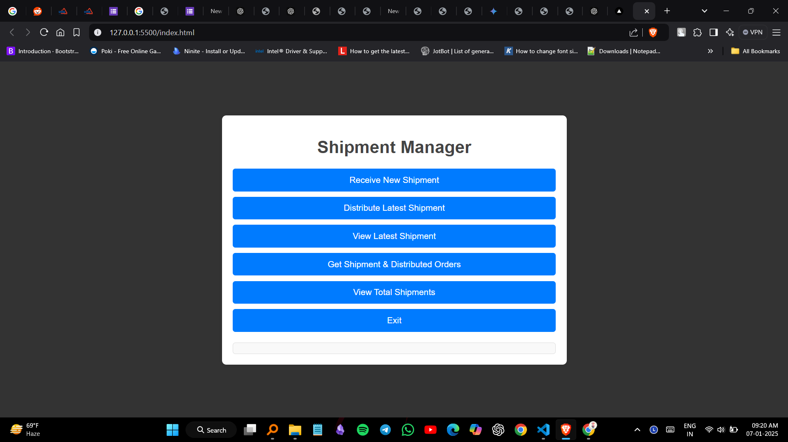

# Shipment Manager

This project is a **Shipment Management System** implemented in Python and a simple web interface using HTML, CSS, and JavaScript. The system helps to manage shipments by allowing users to:

- Receive new shipments.
- Distribute the latest shipment.
- View the most recent shipment.
- Save and retrieve shipment details.
- View total shipments in stock.

## Table of Contents

- [Features](#features)
- [How It Works](#how-it-works)
- [Setup and Usage](#setup-and-usage)
- [Technologies Used](#technologies-used)
- [License](#license)
- [Screenshots](#screenshots)

---

## Features

### Python Application Features

⚡ **Shipment Management**

- Receive and store new shipments.
- Distribute the latest shipment (LIFO order).
- View the most recent shipment.
- Save shipment and distributed order details to a file.

⚖️ **File Handling**

- Shipment details are saved to `details.txt` for future reference.

### Web Interface Features

🔄 **Interactive Menu**

- Buttons for each function like receiving, distributing, and viewing shipments.
- Dynamic output section to display operation results.

🌐 **Responsive Design**

- Clean and minimal design with responsive layout.

---

## How It Works

### Python Code

- **Stack Class**: Implements a stack data structure to handle shipments in a LIFO manner.
- **Manager Class**: Contains methods to manage shipments:
  - `receive_shipment`: Adds a new shipment to the stack.
  - `distribute_latest`: Removes and stores the latest shipment.
  - `latest_shipment_info`: Displays the most recent shipment.
  - `save_shipments_to_file`: Saves shipment details to a file.
  - `view_total_shipments`: Prints the total number of shipments in stock.

### Web Interface

- **HTML Structure**: Provides a user interface with buttons for each action.
- **CSS Styling**: Adds a clean, modern design.
- **JavaScript Logic**: Implements shipment management in the browser:
  - Functions to receive, distribute, view, and get shipment details.
  - Dynamic output display.

---

## Setup and Usage

### Python Application

1. Clone the repository:
   ```bash
   git clone https://github.com/your-repo/shipment-manager.git
   cd shipment-manager
   ```
2. Run the Python application:
   ```bash
   python shipment_manager.py
   ```
3. Follow the menu options to manage shipments.

### Web Interface

1. Open `index.html` in any modern web browser.
2. Use the buttons to interact with the shipment management system.

---

## Technologies Used

- **Python** for backend logic.
- **HTML** for structure.
- **CSS** for styling.
- **JavaScript** for interactivity.

---

## Screenshots


#### Output Section



